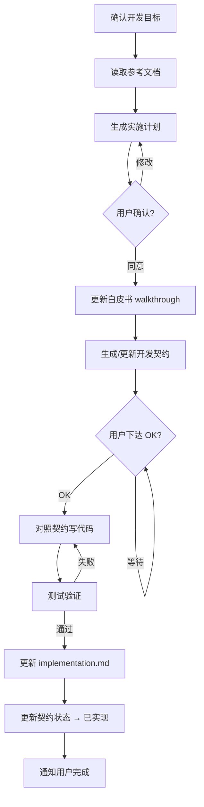

# /dev-module 模块开发工作流

> ⚠️ **核心原则**：先规划、先文档、后写码。每一步都需要用户确认后才能进入下一阶段。

---

## 阶段一：规划与确认

### 1. 确认开发目标

向用户确认要开发或修改的模块名称、需求范围。

### 2. 读取参考文档

// turbo
读取以下文件获取上下文：
- `docs/sri_v2_scenario_analysis.md` — 找到对应业务场景章节
- `docs/admin_design_guidelines.md` — UI 设计约束
- `docs/sri_v2_implementation.md` — 已实现模块清单（避免冲突）
- `docs/sri_v2_walkthrough.md` — 项目白皮书当前状态
- `docs/contracts/{module_id}.contract.md` — 已有契约（如存在）

### 3. 生成实施计划

创建 `implementation_plan.md`，包含：
- 要修改/新增的内容概述
- 涉及的后端文件（Model / Service / Router）
- 涉及的前端文件（Page / Components / API Client）
- 数据模型变更（如有）
- API 接口变更
- 前端页面变更
- 测试验证方案

**⏸️ 暂停，提交给用户审阅，等待用户确认。**

---

## 阶段二：文档同步

用户确认实施计划后，执行以下操作：

### 4. 更新项目白皮书

将本次新增/修改的功能提炼，更新到 `docs/sri_v2_walkthrough.md`：
- 如果是新模块：在模块注册表添加条目，补充功能描述章节
- 如果是修改：更新对应章节的功能描述

### 5. 生成或更新开发契约

按 `docs/contracts/_template.md` 格式，生成或更新 `docs/contracts/{module_id}.contract.md`：
- 新模块：创建完整契约
- 修改功能：更新契约中受影响的部分（数据模型/API/前端规格/业务规则）
- 契约状态标记为 `✅ 已锁定`

### 6. 通知用户

将更新后的白皮书和契约提交给用户查看。

**⏸️ 暂停，等待用户下达 "OK" 指令后，才能进入代码编写阶段。**

---

## 阶段三：代码开发

收到用户 "OK" 指令后，开始编写代码。

### 7. 对照契约开发

**只参考契约文件** + `admin_design_guidelines.md`，不需要重新阅读场景白皮书。

开发顺序：
1. 后端 Model（数据模型 / 数据库迁移）
2. 后端 Service（业务逻辑）
3. 后端 Router（API 接口）
4. 前端 API 客户端
5. 前端页面（遵循设计规范）

---

## 阶段四：测试验证

### 8. 测试

按契约中的验收检查清单逐条自检：
- 后端 API 通过 Swagger / curl 测试
- 权限校验正确
- 状态机流转正确
- 前端页面功能正常
- 错误处理 + 加载态 + 空状态

---

## 阶段五：实现文档同步

### 9. 更新实现记录

// turbo
测试通过后，更新 `docs/sri_v2_implementation.md`：
- 补充新增/修改模块的实现记录
- 更新 API 清单、文件路径、状态

### 10. 更新契约状态

// turbo
将契约标记为 `✅ 已实现`，通知用户全部完成。

---

## 流程图

